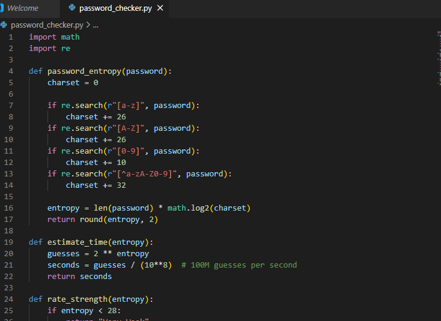
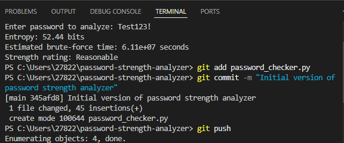

# 🔐 Password Strength Analyzer

A beginner-friendly cybersecurity tool that analyzes password entropy and estimates how long it would take to brute-force crack the password.  
Perfect for portfolios, students, and Python security practice.

---

## 📦 Features

✔️ Calculates password entropy (bits)  
✔️ Estimates brute-force cracking time  
✔️ Detects complexity (uppercase, lowercase, digits, symbols)  
✔️ Provides a human-readable strength rating:
- Very Weak
- Weak
- Reasonable
- Strong
- Very Strong

No external libraries required — pure Python.

---

## 🛠️ Installation

### Clone the Repository
```bash
git clone https://github.com/YOUR_USERNAME/password-strength-analyzer.git
cd password-strength-analyzer
## 📸 Screenshots

### ✔️ Code Preview


### ✔️ Program Output

